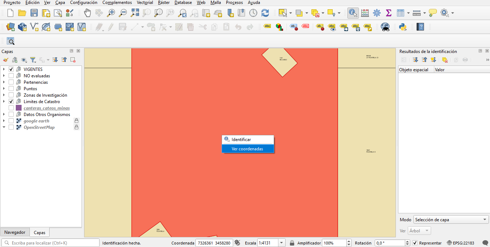
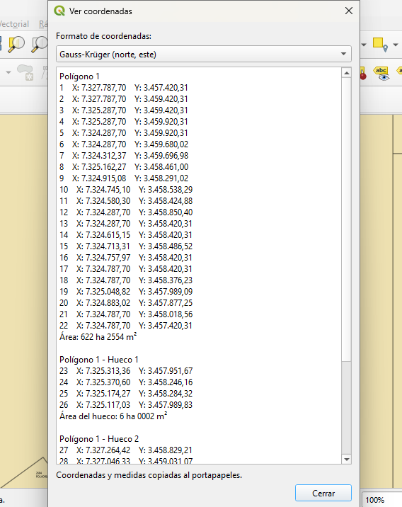
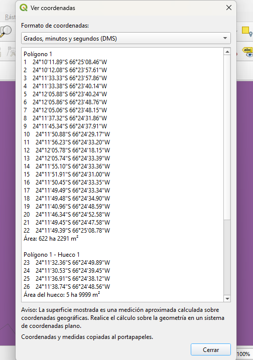
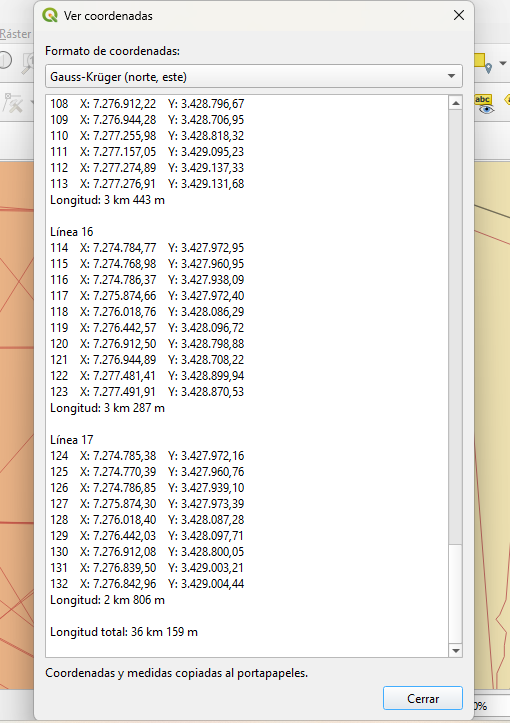

# Ver Coordenadas

**Ver Coordenadas** es un complemento para QGIS que permite consultar y copiar rápidamente los vértices y las medidas de entidades vectoriales lineales y poligonales mediante una acción contextual sobre la entidad.

La versión **1.0.0** está pensada para un flujo de trabajo simple: identificar una entidad, ejecutar **Ver coordenadas**, elegir el formato deseado y obtener en una ventana las coordenadas, áreas o longitudes correspondientes. El contenido se copia automáticamente al portapapeles.

## Características

- Soporte para **Polygon** y **MultiPolygon**.
- Soporte para **LineString** y **MultiLineString**.
- Numeración continua de vértices.
- Eliminación del vértice de cierre duplicado en anillos poligonales.
- Identificación de huecos en polígonos.
- Área neta por polígono.
- Área individual de cada hueco.
- Área total en geometrías MultiPolygon.
- Longitud individual y total en geometrías lineales.
- Formatos específicos para CRS proyectados y geográficos.
- Copia automática de coordenadas y medidas al portapapeles.
- Recordatorio del último formato elegido mediante la configuración de QGIS.

## Compatibilidad

- **QGIS 4.2 o superior**.
- Capas vectoriales lineales y poligonales.

## Instalación

### Instalación actual desde ZIP

Mientras el complemento se encuentra en proceso de publicación en el repositorio oficial de QGIS, puede instalarse manualmente desde un archivo ZIP:

1. Descargar el archivo ZIP de una versión del complemento.
2. Abrir QGIS.
3. Ir a **Complementos → Administrar e instalar complementos**.
4. Seleccionar **Instalar desde ZIP**.
5. Elegir el archivo ZIP descargado.
6. Presionar **Instalar complemento**.

Una vez que **Ver Coordenadas** sea aprobado y publicado en el repositorio oficial de QGIS, esta sección se actualizará con el método de instalación directa desde el administrador de complementos.

## Cómo usarlo

1. Utilizar la herramienta **Identificar objetos espaciales** de QGIS.
2. Seleccionar una entidad lineal o poligonal.
3. En los resultados de identificación, ejecutar la acción **Ver coordenadas**.
4. Elegir el formato de coordenadas deseado.
5. Consultar los vértices y las medidas mostradas en la ventana.
6. El contenido se copia automáticamente al portapapeles.

<p align="center">
  
</p>

## Formatos de coordenadas

El complemento detecta si el CRS de la capa es proyectado o geográfico y muestra las opciones correspondientes.

### CRS proyectados

#### Gauss-Krüger (norte, este)

Es el formato predeterminado para capas proyectadas.

Ejemplo:

```text
1   X: 7312456,32   Y: 3556789,14
```

En este modo, el componente **norte** se presenta primero y el componente **este** en segundo lugar, siguiendo la convención utilizada habitualmente para coordenadas Gauss-Krüger.

#### Coordenadas tradicionales (este, norte)

Ejemplo:

```text
1   X: 3556789,14   Y: 7312456,32
```

Cambiar entre ambos formatos **no reproyecta la geometría**. Solo modifica el orden en que se presentan los componentes de cada coordenada.

<p align="center">
  
</p>

### CRS geográficos

Para capas con CRS geográfico se ofrecen tres formatos.

#### Grados, minutos y segundos (DMS)

Formato predeterminado:

```text
41°24'12.20"N 2°10'26.50"E
```

#### Grados y minutos decimales (DMM)

```text
41° 24.203333'N 2° 10.441666'E
```

#### Grados decimales (DD)

```text
41.40338888°N 2.17402777°E
```

Los hemisferios se indican mediante:

- **N**: Norte.
- **S**: Sur.
- **E**: Este.
- **W**: Oeste.

<p align="center">
  
</p>

## Áreas y longitudes

### CRS proyectados

Las áreas y longitudes se calculan de forma planimétrica utilizando la geometría de la entidad.

Los resultados se presentan en unidades fáciles de leer:

```text
Área: 50 ha 0735 m²
Longitud: 5 km 125 m
```

Cuando corresponde, el complemento convierte las unidades del CRS a metros o metros cuadrados antes de aplicar el formato final.

### CRS geográficos

Para CRS geográficos, **Ver Coordenadas** utiliza `QgsDistanceArea` para realizar mediciones elipsoidales empleando el CRS de origen y la configuración geodésica disponible en QGIS.

Debido a que una medición elipsoidal puede diferir ligeramente de una medición planimétrica realizada sobre una proyección adecuada, el complemento muestra una advertencia específica.

Para polígonos:

> **Aviso:** La superficie mostrada es una medición aproximada calculada sobre coordenadas geográficas. Realice el cálculo sobre la geometría en un sistema de coordenadas plano.

Para líneas:

> **Aviso:** La longitud mostrada es una medición aproximada calculada sobre coordenadas geográficas. Realice el cálculo sobre la geometría en un sistema de coordenadas plano.

## Polígonos con huecos y geometrías multipartes

El complemento distingue las partes de una geometría y mantiene una numeración continua de vértices.

Ejemplo conceptual:

```text
Polígono 1
1   ...
2   ...
3   ...
Área: 96 ha 0000 m²

Polígono 1 - Hueco 1
4   ...
5   ...
6   ...
Área del hueco: 4 ha 0000 m²

Polígono 2
7   ...
8   ...
9   ...
Área: 50 ha 0000 m²

Área total: 146 ha 0000 m²
```

El área mostrada para cada polígono es su **superficie neta**, es decir, el área exterior menos sus huecos. El área de cada hueco se muestra adicionalmente a modo informativo.

En geometrías lineales multipartes se muestra la longitud de cada línea y una longitud total.

<p align="center">
  
</p>

Las capturas adicionales disponibles en la carpeta [`screenshots/`](screenshots/) se conservan como referencia visual de otras funciones y variantes de presentación del complemento.

## Reportar errores o solicitar mejoras

Si encuentra un error o desea proponer una mejora, utilice el sistema de **Issues** del repositorio:

https://github.com/santiamaster/ver-coordenadas-qgis/issues

Para facilitar el diagnóstico, incluya en lo posible:

- versión de QGIS;
- sistema operativo;
- CRS de la capa;
- tipo de geometría;
- pasos para reproducir el problema;
- captura de pantalla o mensaje de error, si existe.

## Autoría

**Secretaría de Minería de Salta**  
Desarrollado y mantenido por: **Carlos Daniel Santiápichi Mastrolinardo**  
Contacto: **mineriayenergia@produccionsalta.gob.ar**

## Licencia

Este proyecto se distribuye bajo la **GNU General Public License v2.0 o posterior (GPL-2.0-or-later)**.

Consulte el archivo [`LICENSE`](LICENSE) para conocer los términos completos.
